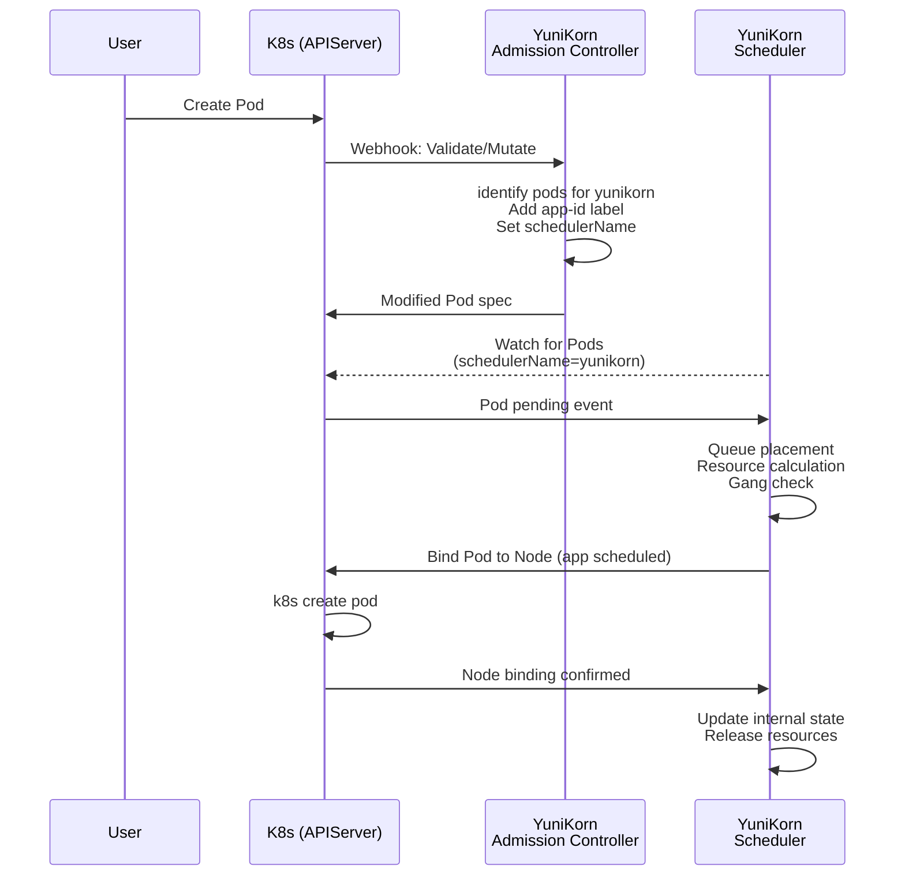

```mermaid
sequenceDiagram
    participant User
    participant API as K8s (APIServer)
    participant AC as YuniKorn<br/>Admission Controller
    participant YK as YuniKorn<br/>Scheduler

    User->>API: Create Pod
    API->>AC: Webhook: Validate/Mutate
    AC->>AC: identify pods for yunikorn<br>Add app-id label<br/>Set schedulerName
    AC->>API: Modified Pod spec
    
    YK-->>API: Watch for Pods<br/>(schedulerName=yunikorn)
    API->>YK: Pod pending event
    
    YK->>YK: Queue placement<br/>Resource calculation<br/>Gang check
    YK->>API: Bind Pod to Node (app scheduled)
    API->>API: k8s create pod

    API->>YK: Node binding confirmed
    YK->>YK: Update internal state<br/>Release resources
```
